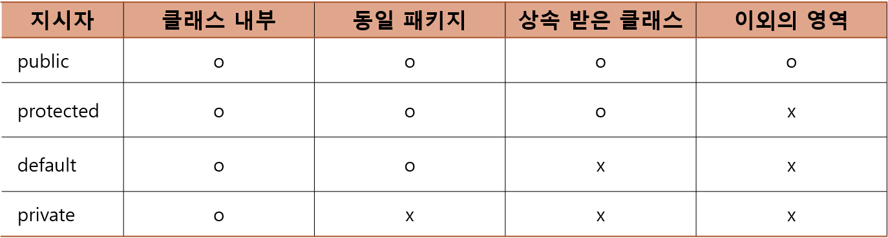

# 2021-java-study-project
## ◎ Java study project list

1. Java Wrapper class
2. Java package naming
3. Access-level modifiers
4. Constants
5. Wildcard
6. Extension
7. Static variable(Java 책 223p 까지만 정리 추후 추가 정리 필요)
8. Collection framework


### 01 Java wrapper class


### 02 Java package naming


### 03 접근 수준 지시자(Access-level Modifiers)

- pulbic
  - 어디서든 접근이 가능하다.
- protected
  - default 선언이 허용하는 접근을 모두 허용한다.
  - 더불어 protected는 default가 허용하지 않는 '한 영역'에서의 접근도 허용한다.
- private
  - 클래스 내부에서만 접근 가능
- default
  - default는 키워드가 아닌, '아무런 선언도 하지 않은 상황을 의미한다.'
  - 비록 이는 키워드가 아닌 일종의 '상황'이지만 이 역시 '접근 수준 지시자'의 한 종류로 구분을 한다.
  - 그리고 이러한 선언을 할 수 있는 대상은 다음 두가지이다.
    - 클래스의 정의
      - 클래스의 정의를 대상으로는 다음 두가지 선언이 가능하다.
        - pulbic
        - default
    - 클래스의 인스턴스 변수와 메소드
      - 인스턴스 변수와 메소드를 대상으로는 다음 네가지 선언이 모두 가능하다.
        - public
        - protected
        - private
        - default

#### • 클래스 정의 대상의 pulbic과 default 선언이 갖는 의미

```java
public class AAA { // 클래스의 pulbic 선언`
}
```

```java
class ZZZ { // 클래스의 default 선언`
}
```

- 정리하면, 클래스 정의에 대한 public과 default 선언이 갖는 의미는 다음과 같다.
  - public
    - 어디서든 인스턴스 생성이 가능하다.
  - default
    - 동일 패키지로 묶인 클래스 내에서만 인스턴스 생성을 허용한다.



### 04 Constants(상수)

변수를 선언할 때 그 앞에 final이라는 선언을 추가하면 그 변수는 '상수'가 된다. 그리고 다음 두가지 특징을 지니게 된다.

- 값을 딱 한 번만 할당할 수 있다.
- 한 번 할당된 값은 변경이 불가능하다.

```java
public class Constants {
    public static void main(String[] args) {
        final int MAX_SIZE = 100;
        final char CONST_CHAR = '상';
        final int CONST_ASSIGNED;

        CONST_ASSIGNED = 12;
        System.out.println("상수1 : " + MAX_SIZE);
        System.out.println("상수2 : " + CONST_CHAR);
        System.out.println("상수3 : " + CONST_ASSIGNED);
    }
}
```

### 05 Wildcard(만능패)

```java
/**
 * 아래 와일드 카드의 경우
 * Number를 상속하는 하위 클래스가 올 수 있다.
 * 하위 클래스는 Integer와 Double이 올 수 있다.
 * wildecard extends의 경우 다음과 같이 to set을 할 수 없다.
 * 이유는 어떤 값을 저장할지 알 수 없기 때문이다.
 * to set을 하려고 하는 값이 어떤 값이 올지 알 수 없다.
 * 그 값이 double일지, 아니면 Integer일지 알 수 없으므로 다음과 같이 컴파일 에러가 발생한다.
 * @param box5
 */
public static void peekBox(Box5<? extends Number> box5, int n) { // Wildcard 사용 메소드
    System.out.println(box5.getOb());
    // TODO : 컴파일 오류 확인 원할 경우 주석 해제
    // box5.setOb(n);
}

/**
 * 아래 와일드 카드의 경우
 * Integer 또는 Inter가 상속하는 클래스가 올 수 있다
 * 상속하는 클래스로는 Integer, Number, Object가 올 수 있다.
 * wildecard super의 경우 to get을 할 수 있다.
 * 정확히 말하자면 to get은 가능하나 값을 저장하는데에 제한이 있다.
 * 아래와 같이 Object 변수에는 저장이 가능하다 Object 변수의 경우 위에 상속하는 클래스에 최상위에 있으므로
 * 다음과 같이 어떤 타입이 와도 저장이 가능하다
 * 그러나 Integer 타입 변수의 경우 box5의 to get을 한 값이 어떤 값이 올지 알 수 없으므로 값을 저장을 할 수가 없게된다.
 * @param box5
 * @param n
 */
public static void setBox(Box5<? super Integer> box5, int n) {
    box5.setOb(n);
    Object t = box5.getOb();
    // TODO : 컴파일 오류 확인 원할 경우 주석 해제
    // Integer k = box5.getOb();
    System.out.println(box5.getOb());
}
```

#### 참조변수를 Object형으로 선언하는 것은 피해야 한다.

자바는 Object형 잠조변수의 선언이나 Object형으로의 형 변환이 불필요하도록 문법을 개선시켜왔다. Object라는 이름이 코드에 직접 등장하는 것은 컴파일러를 통한 오류의 발견 가능성을 낮추는 행위이기 때문이다.

#### 언제 와일드카드에 제한을 걸어야 하는가?

와일드카드의 상한과 하한 제한이 필요한 이유의 본질은 그 자체로 이해하기 난해한 부분이 있다.

매개변수 선언 : Box<? extends Toy> box

**→ box가 참조하는 인스턴스를 대상으로 꺼내는 작업만 허용하겠다는 의미**

매개변수 선언 : Box<? super Toy> box

**→ box가 참조하는 인스턴스를 대상으로 넣는 작업만 허용하겠다는 의미**

#### • 제네릭을 이용한 상한, 하한 제한으로 에러 방지

 다음과 같은 에러를 방지 하기 위해 상한 제한 또는 하한 제한을 걸어둬 에러를 방지할 수 있다.

```java
public class BoundedWildcardGeneric {

    /**
     * box에 con과 동일한 내용물이 들었는지 확인
     *
     * @param box - 기존 Box11<T> box 선언에서 Box11<? extends T>로 수정하여 에러를 해결할 수 있다.
     * @param con
     * @param <T>
     * @return
     */
    public static <T> boolean compBox(Box11<? extends T> box, T con) {
        T bc = box.getOb();
        // TODO : 에러 발생하는 부분 확인을 원할 경우 주석 해제
        // box.setOb(con); // 프로그래머의 실수로 삽입된 문장 때문에 내용물이 바뀐다.
        return bc.equals(con);
    }

    public static void main(String[] args) {
        Box11<Integer> box1 = new Box11<>();
        box1.setOb(24);
        Box11<String> box2 = new Box11<>();
        box2.setOb("Poly");

        if(compBox(box1,25))
            System.out.println("상자 안에 25 저장");
        if(compBox(box2, "Moly"))
            System.out.println("상자 안에 Moly 저장");

        System.out.println(box1.getOb());
        System.out.println(box2.getOb());
    }
}

class Box11<T> {
    private T ob;

    public T getOb() {
        return ob;
    }

    public void setOb(T ob) {
        this.ob = ob;
    }
}
```

#### • 제네릭 인터페이스의 정의와 구현

클래스외에 다음과 같이 인터페이스 역시 클래스와 마찬가지로 제네릭으로 정의할 수 있다.

```java
package generic2;

public class GetableGenericInterface {
    public static void main(String[] args) {
        Box12<Toy3> box = new Box12<>(); // 다음과 같이 T를 대신할 자료형이 Toy3로 동일해야 참조 가능함
        box.setOb(new Toy3());

        Getable<Toy3> gt = box; // Box12<T>가 Getable를 구현하므로 참조 가능 // 다음과 같이 T를 대신할 자료형이 Toy3로 동일해야 참조 가능함
        System.out.println(gt.get());
    }
}

interface Getable<T> {
    public T get();
}

/**
 * 인터페이스 Getable<T>를 구현하는 Box12<T> 클래스
 * @param <T>
 */
class Box12<T> implements Getable<T> {
    private T ob;

    public void setOb(T ob) {
        this.ob = ob;
    }

    @Override
    public T get() {
        return ob;
    }
}

class Toy3 {
    @Override
    public String toString() {
        return "I am a Toy";
    }
}
```

제네릭 인터페이스를 구현할 때에는 다음과 같이 T를 결정한 상태로 구현할 수도 있다.

단, 이렇듯 제네릭 인터페이스의 T를 String으로 결정하면 Getable<T>의 메소드를 구현할 때에도 다음과 같이 T가 아닌 String으로 명시하고 구현해야 한다.

``` java
class Box<T> implements Getable<String {...} // 제네릭 인터페이스를 구현할 때 다음과 같이 T를 결정한 상태로 구현할 수도 있다.

@Override
public String get() {...}
```

```java
public class GetableGenericInterface2 {
    public static void main(String[] args) {
        Box13<Toy4> box = new Box13<>();
        box.setOb(new Toy4());

        /**
         * Getable1<String>형 참조변수는 다음과 같이 Box14<T> 인스턴스를 T의 자료형에 상관없이 참조할 수 있다.
         * Box13의 참조변수가 Toy4여도 참조할 수 있음
         */
        Getable1<String> gt = box;
        System.out.println(gt.get());
    }
}

interface Getable1<T> {
    public T get();
}

class Box13<T> implements Getable1<String> {
    private T ob;

    public void setOb(T ob) {
        this.ob = ob;
    }

    @Override
    public String get() { // 반환형은 T가 아닌 String이어야 한다.
        return "I am a Toy";
    }
}

class Toy4 {
    @Override
    public String toString() {
        return "I am a Toy";
    }
}
```

### 06 Extension(상속)

#### • 상속에 대한 매우 치명적인 오해

상속은 코드의 재활용을 위한 문법이다 ← 해당 내용은 상속에 대한 매우 치명적인 오해이다.

상속은 코드의 재활용을 목적으로 사용하는 문법이 아니다.

만약에 재활용을 목적으로 상속을 사용할 경우 무의미하게 코드가 복잡해지고, 기대와 달리 코드를 재활용하지 못하는 상황을 쉽게 경험하게 될 것이다.

코드의 재활용은 프로그래머라면 누구나 바라는 일이다. 그러나 이를 목적으로 20년 넘게 한문적으로 연구가 진행 중이다.

그러나 전자부품이나 기계부품처럼 일부를 뜯어서 다른 장치에 사용하는 것은 아직은 요원한 일이며,

소프트웨어의 특성상 이러한 형태의 재활용이 아닌 다른 형태의 재활용이 시도되고 연구되고 있다.


#### • 상속이란?

연관된 일련의 클래스들에 대해 공통적인 규약을 정의할 수있다.


#### • 상속의 가장 기본적인 특성

상속을 단순하게 설명하면 기존에 정의된 클래스에 메소드와 변수를 추가하여 새로운 클래스를 정의하는 것이 상속이다.

다음과 같이 상속(extends)이란 단어(extension)의 명상적 번역은 다음과 같이 뻗음, 뻗침으로 번역할 수 있다.

상속이라고 하지만 실은 가지가 뻗치든 뻗치는 코드를 의미한다.


그럼 예를 들어서 다음의 클래스가 정의되어 있다고 가정해보자.

```java
class Man {
	String name;
	public void tellYourName() {
		System.out.println("My name is" + name);
	}
}
```

이때 위의 클래스를 상속하여(물려 받아서) 다음과 같이 새로운 클래스를 정의할 수 있다. 참고로 키워드의 extends는 상속을 의미하는 키워드이다. 

즉 extends Man은 Man 클래스를 상속한다는 의미이다.

```java
class BusinessMan extends Man { // Man을 상속하는 BusinessMan
	String company;
	String position;
	public void tellYourInfo() {
		System.out.println("My company is " + company);
		System.out.println("My position is " + position);
		tellYourName(); // Man 클래스를 상속했기 때문에 호출 가능!
	}
}
```

그리고 이렇게 Man 클래스를 상속하는 BusinessMan 클래스의 인스턴스를 생성하면, 다음 형태의 인스턴스가 생성된다.

```java
BusinessMan man = new BusinessMan();

// 다음 형태의 인스턴스가 생성
String name; // Man의 멤버 변수
String companay;
String position
void tellYourName() {...} // Man의 멤버
void tellYourInfo() {...}
```

#### • 생성자 호출

- 하위 클래스의 인스턴스 생성 시 상위 클래스, 하위 클래스의 생성자 모두 호출된다.
- 하위 클래스의 인스턴스 생성 시 상위 클래스의 생성자가 먼저 호출된다.

아래 코드에서는 두 클래스의 적절한 생성자 정의 모델을 보이고 있다.

**결론은 간단하다. 상속 관계에 있을지라도 인스턴스 변수는 각 클래스의 생성자를 통해서 초기화해야 한다는 것이다.**

```java
package extends_examples1;

public class MyBusinessMan2 {
    public static void main(String[] args) {
        BusinessMan businessMan = new BusinessMan("YOON", "Hybrid ELD", "Staff Eng");
        businessMan.tellYourInfo();
    }
}

class Man {
    String name;

    public Man(String name) {
        this.name = name;
    }

    public void tellYourName() {
        System.out.println("My name is " + name);
    }
}

class BusinessMan extends Man {
    String company;
    String position;

    public BusinessMan(String name, String company, String position) {
        super(name); // 상위 클래스의 생성자 호출
        this.company = company;
        this.position = position;
    }

    public void tellYourInfo() {
        System.out.println("My company is" + company);
        System.out.println("My position is" + position);
        tellYourName();
    }
}
```

#### • 단일 상속만을 지원하는 자바

자바는 프로그램이 과도하게 복잡해지는 것을 막기 위해 단일 상속만을 지원한다. 이는 다음과 같이 하나의 클래스가 상속할 수 있는 클래스의 수가 최대 하나라는 것을 의미한다.

```java
class AAA {...}
class ZZZ extends AAA {...}
```

그러나 다음과 같이 상속의 깊이를 더하는 것은 얼마든지 가능하다.

```java
class AAA {...}
class MMM extends AAA {...}
class ZZZ extends MMM {...}
```

#### • static 선언이 붙는 '클래스 변수'와 '클래스 메소드'의 상속

앞서 공부한 클래스 변수와 클래스 메소드의 특징을 정리하면 다음과 같다.

- 인스턴스의 생성과 상관이 없이 접근이 가능하다.
- 클래스 내부와 외부에서(접근 수준 지사자가 허용하면) 접근이 가능하다.
- 클래스 변수와 클래스 메소드가 위치한 클래스 내에서는 직접 접근이 가능하다.

즉 클래스 변수와 클래스 메소드는 인스턴스에 속하지 않는, 딱 하나만 존재하는 변수와 메소드이다.

따라서 상속의 대상이 아니다.

```java
class SuperCLS {
	static int count = 0; // 클래스 변수
	public SuperCLS() {
		count++; // 클래스 내에서는 직접 접근이 가능
	}
}
```

### 07 Static variable(클래스 변수)

'인스턴스 변수'는 인스턴스가 생성되었을 때, 생성된 인스턴스 안에 존재하는 변수이다. 그러나 '클래스 변수'는 인스턴스의 생성과 상관없이 존재하는 변수이다.

#### • 선언된 클래스의 모든 인스턴스가 공유하는 '클래스 변수(static 변수)'

클래스 내에 선언된 변수 앞에 static 선언을 붙이면 이는 인스턴스 변수가 아닌 '클래스 변수'가 된다.

이러한 클래스 변수의 특성을 파악하기 위해서 다음 예제를 관찰하자.

다음과 같이 정의 및 선언시 기대할 수 있는 결과로 변수 instNum의 값은 모두 1이 호출되어야 한다.

```java
public class ClassVar {
    public static void main(String[] args) {
        InstCnt instCnt1 = new InstCnt();
        InstCnt instCnt2 = new InstCnt();
        InstCnt instCnt3 = new InstCnt();
    }
}

class InstCnt {
    static int instNum = 0; // 클래스 변수(static 변수)

    InstCnt() { // 생성자
        instNum++; // static으로 선언된 변수의 값 증가
        System.out.println("인스턴스 생성 : " + instNum );
    }
}
```

그러나 기대한 결과와 다르게 instNum값은 공유라도 한듯 1씩 증가한 값이 되었다.


> static으로 선언된 변수는 변수가 선언된 클래스의 모든 인스턴스가 공유하는 변수이다.

클래스 변수(static 변수)는 인스턴스 내에 존재하는 변수가 아니라 **'어떠한 인스턴스에도 속하지 않는 상태로 메모리 공간에 딱 하나만 존재하는 변수'이다.**

다만 이 변수가 선언된 클래스의 인스턴스들은 이 변수에 바로 접근할 수 있는 권한이 있을 뿐이다.

그리고 클래스 변수도 '접근 수준 지시자'의 규칙을 그대로 적용받기 때문에 public으로 선언되면 어디서든 접근이 가능하다. 물론 접근 방법에 있어서는 차이를 보인다.


#### • 클래스 변수의 초기화 시점과 초기화 방법

클래스 변수가 언제 메모리 공간에 할당되고 초기화되는지 다음 예제를 보도록하자.

```java
public class OnlyClassNoInstance {
    public static void main(String[] args) {
        InstCnt2.instNum -= 15;
        System.out.println(InstCnt2.instNum);
    }
}

class InstCnt2 {
    static int instNum = 100;

    public InstCnt2() {
        instNum++;
        System.out.println("인스턴스 생성: " + instNum);
    }
}
```

다음 결과를 보면 알 수 있는 사실은 다음과 같다.

> 클래스 변수는 인스턴스 생성 이전에 메모리 공간에 존재한다.


결론을 말하자면, 클래스 변수는 해당 클래스 정보가 가상머신에 의해 읽히는 순간 메모리 공간에 할당되고 초기화된다. 그리고 한 가지 확실한 것은 이러한 할당과 초기화는 위의 예제에서 보이듯이 인스턴스의 생성과 무관하게 이뤄진다는 점이다. 따라서 다음과 같이 생성자를 통한 클래스 변수의 초기화를 진행하지 않도록 주의해야 한다.

```java
class InstCnt {
	static int instNum = 100; // 클래스 변수의 정상적인 초기화 방법
	InstCnt() {
		instNum = 0; // 클래스 변수의 초기화가 아니다!
	}
}
```

위의 클래스 변수 instNum은 100으로 초기화된다. 클래스 정보가 가상머신에 의해 읽히는 순간 100으로 초기화된다.

그런데 생성자 변수 instNum을 0으로 다시 초기화한다. 따라서 인스턴스가 생성될 때마다 instNum은 매번 그 값이 0으로 바뀌게 된다.

> 앞서 설명에서 클래스 정보를 가상 머신이 읽는다는 표현을 썼는데, 이렇듯 가상머신이 특정 클래스 정보를 읽는 행위를 가리켜 클래스 로딩이라 한다. 그리고 특정 클래스의 인스턴스 생성을 위해서는 해당 클래스가 반드시 가상머신에 의해 로딩되어야 한다. 즉 인스턴스 생성보다 클래스 로딩이 먼저이다.

• 클래스 변수를 언제 유용하게 활용할 것인가?

앞서 제시했던 예제를 통해서도 클래스 변수가 유용하게 활용되는 상황 한 가지를 짐작할 수 있다.

> 인스턴스 간에 데이터 공유가 필요한 상황에서 클래스 변수를 선언한다

그럼 이어서 클래스 변수가 유용하게 사용되는 사례를 하나 더 보이겠다.

이는 '클래스 내부와 외부에서 참조해야 할 정보'를 클래스 변수에 담은 예이다.

아래 예제에서 PI가 상수로 선언이 된다. PI가 지닌 값은 '원주율'로 결코 변하지 않는 값이기 때문이다. 그런데 인스턴스 변수가 아닌 '클래스 변수'로 선언되었다.

**이는 모든 Circle 인스턴스가 참조해야 하는 값이지만, 인스턴스가 각각 지녀야 하는 값은 아니기 때문이다.**

```java
package static_variable_examples;

public class CircleConstPI {
    public static void main(String[] args) {
        Circle circle = new Circle(1.2);
        circle.showPerimeter();
        circle.showArea();
    }
}

class Circle {
    static final double PI = 3.1415; // 변하지 않는, 참조가 목적인 값  // 변수를 선언할 때 그 앞에 final이라는 선언을 추가하면 그 변수는 '상수'가 된다. 그리고 다음 두가지 특징을 지니게 된다.
    private double radius;

    public Circle(double radius) {
        this.radius = radius;
    }

    void showPerimeter() {
        double peri = (radius * 2) * PI;
        System.out.println("둘레 : " + peri);
    }

    void showArea() {
        double area = (radius * radius) * PI;
        System.out.println("넓이 : " + area);
    }

}
```

### 08 Collection framework(컬레션 프레임워크)

#### • 프레임어크라는 표현의 이해

프레임워크(Framework)라는 표현은 여러 분야에서 상이한 개념으로 사용되기 때문에, 이에 대한 정확한 이미 파악이 쉽지 않을 수 있다. 하지만 기본적으로 다음 의미를 공통적으로 지닌다.

> 잘 정의된 구조 또는 골격

따라서 자바에서 말하는 프레임 워크는 다음과 같이 이해할 수 있다.

> 잘 정의된 구조의 클래스들

즉 프레임워크는 프로그래머들이 쓸 수 있도록 잘 정의된 클래스들의 모임이라 할 수 있다.

그런데, 이것이 전부라면 이는 '라이브러리'라 불리게 된다. 하지만 '컬렉션 라이브러리'라 하지 않고 '컬렉션 프레임워크'라 한다. 이는 컬렉션 관련된 클래스의 정의에 적용되는 설계 원칙 또는 구조가 존재하기 때문이다.

#### • 컬렉션의 의미와 자료구조

컴퓨터 분야에는 '자료구조(Data Structures)'와 '알고리즘(Algorithms)'이라는 학문이 있다. 이중 **'자료구조는 데이터의 저장 관련 학문으로 데이터의 탐색, 삭제 등 다양한 측면을 고려한 데이터의 효율적인 저장 방법을 연구하는 학문'**이다. 반면 **'알고리즘은 저장된 데이터의 일부 또는 전체를 대상으로 하는 각종 가공 및 처리의 방법을 연구하는 학문'**이다. 따라서 이 둘은 서로 다른 학문임에도 불구하고 긴밀히 연관되어 있다. 

자료구조에서 정형화하고 있는 데이터의 저장 방식 중 대표적인 몇 가지를 정리하면 다음과 같다.

리스트(List), 스택(Stack), 큐(Queue), 트리(Tree), 해쉬(Hash)

그리고 위 자료구조들을 대상으로 하는 비교적 간단한 알고리즘 몇 가지를 소개하면 다음과 같다.

버블 정렬(Bubble sort), 퀵 정렬(Quick Sort), 이진 탐색(Binary Search)

그렇다면 컬렉션 프레임워크는 무엇에 대한 프레임워크일까? 이는 데이터의 저장 방법 그리고 이와 관련 있는 알고리즘에 대한 프레임워크이다. 더 쉽게 표현하면, 위에서 언급한 자료구조와 알고리즘을 제네릭 기반의 클래스와 메소드로 미리 구현해 놓은 결과물이다. 따라서 컬렉션 프레임워크를 이용하면 자료구조를 몰라도 트리 기반으로 데이터를 저장할 수 있고, 알고리즘을 몰라도 이진 탐색을 수행할 수 있다.

#### • ArraList<E> 클래스

**List<E> 인터페이스를 구현하는 대표적인 컬렉션 클래스 둘은 다음과 같다.**

- ArrayList<E> : 배열 기반 자료구조, 배열을 이용하여 인터스턴스 저장
- LinkedList<E> : 리스트 기반 자료구조, 리스트를 구성하셔 인스턴스 저장

List<E> 인터페이스를 구현하는 컬렉션 클래스들이 갖는 공통적인 특성 두 가지가 있는데 이는 다음과 같다.

- 인스턴스의 저장 순서를 유지한다.
- 동일한 인스턴스의 중복 저장을 허용한다.

```java
List<DataMap> dataMapList = new ArrayList<>(); // 다음과 같이 제네릭 클래스로 <E>에 자료형을 넣어서 해당 자료형 클래스 변수를 생성한다. List의 경우 여러 자료형이 올 수 있으므로 이렇게 제네릭 클래스로 만드는게 효율적이라고 볼 수 있겠다.(추후 제네릭 클래스를 만들 때 참고 필요)
```

